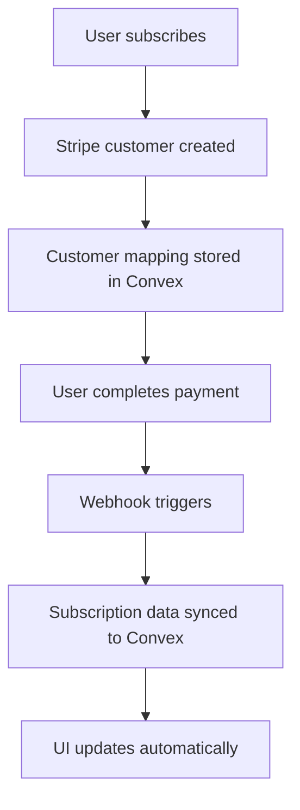

# Stripe + Clerk + Convex Integration Setup

This guide shows you how to set up the complete Stripe subscription system with Clerk authentication using Convex as your database.

## 🎯 Why Convex Instead of KV?

- ✅ **No external dependencies** - Use your existing Convex database
- ✅ **Real-time updates** - Automatic UI updates when subscription changes
- ✅ **Type safety** - Full TypeScript support with generated types
- ✅ **Better queries** - Rich querying capabilities vs simple key-value
- ✅ **Free tier** - No additional costs for small apps
- ✅ **Local development** - Works offline with local Convex instance

## 🚀 Setup Steps

### 1. Environment Variables

Update your `.env.local`:

```bash
# Convex (you should already have this)
VITE_CONVEX_URL=https://your-convex-deployment.convex.cloud

# Clerk Authentication
VITE_CLERK_PUBLISHABLE_KEY=pk_test_...
CLERK_SECRET_KEY=sk_test_...

# Stripe Configuration
STRIPE_SECRET_KEY=sk_test_...
NEXT_PUBLIC_STRIPE_PUBLISHABLE_KEY=pk_test_...
STRIPE_WEBHOOK_SECRET=whsec_...

# Application URLs
NEXT_PUBLIC_BASE_URL=http://localhost:5173
```

### 2. Convex Schema Updates

The new Convex schema includes these tables:

- **`stripeCustomers`** - Maps Clerk users to Stripe customers
- **`stripeSubscriptions`** - Stores current subscription data

The schema is already updated in `convex/schema.ts` with proper indexes.

### 3. Deploy Schema Changes

```bash
bun convex deploy
```

This will create the new tables in your Convex database.

### 4. App Integration

Wrap your app with both Clerk and Convex providers:

```tsx
// src/main.tsx
import { ClerkProvider } from '@/components/ClerkProvider';
import { ConvexProvider, ConvexReactClient } from 'convex/react';

const convex = new ConvexReactClient(import.meta.env.VITE_CONVEX_URL!);

function App() {
  return (
    <ConvexProvider client={convex}>
      <ClerkProvider>
        <BrowserRouter>
          {/* Your app routes */}
        </BrowserRouter>
      </ClerkProvider>
    </ConvexProvider>
  );
}
```

## 📊 How It Works

### Data Flow



### Convex Tables

**stripeCustomers**
```typescript
{
  clerkUserId: string,        // Clerk user ID
  stripeCustomerId: string,   // Stripe customer ID  
  email: string,
  name?: string,
  createdAt: number,
  updatedAt: number
}
```

**stripeSubscriptions**
```typescript
{
  stripeCustomerId: string,   // Links to stripeCustomers
  subscriptionId: string,     // Stripe subscription ID
  priceId: string,           // Stripe price ID
  status: string,            // active, canceled, etc.
  currentPeriodStart: number, // Unix timestamp
  currentPeriodEnd: number,   // Unix timestamp
  cancelAtPeriodEnd: boolean,
  paymentMethod?: {
    brand: string,
    last4: string
  },
  planName?: string,
  createdAt: number,
  updatedAt: number
}
```

## 🔧 Key Components

### Real-time Subscription Status

The `SubscriptionStatus` component now uses Convex queries for real-time updates:

```tsx
import { useQuery } from 'convex/react';
import { api } from '../../convex/_generated/api';

const subscriptionData = useQuery(
  api.stripe.getSubscriptionByClerkUserId,
  { clerkUserId: userId }
);
```

### Available Convex Functions

**Queries** (read data):
- `getStripeCustomerId(clerkUserId)` - Get Stripe customer ID
- `getSubscriptionData(stripeCustomerId)` - Get subscription by customer ID
- `getSubscriptionByClerkUserId(clerkUserId)` - Get subscription by Clerk user
- `getAllActiveSubscriptions()` - Admin function for analytics

**Mutations** (write data):
- `setStripeCustomer(...)` - Create/update customer mapping
- `setSubscriptionData(...)` - Create/update subscription
- `deleteSubscriptionData(customerId)` - Remove subscription

## 🧪 Testing

### 1. Local Development

```bash
# Start Convex in one terminal
bun convex dev

# Start your app in another terminal  
bun run dev

# Start your backend server in a third terminal
node server/index.js
```

### 2. Test the Flow

1. Sign in with Clerk
2. Click subscribe button
3. Complete payment with test card: `4242 4242 4242 4242`
4. Check Convex dashboard - you should see data in the new tables
5. Verify the UI updates automatically

### 3. Convex Dashboard

Go to your Convex dashboard to:
- View table data in real-time
- Run queries manually
- Monitor function calls
- Check logs

## 🚀 Production Deployment

### 1. Deploy Convex Functions

```bash
bun convex deploy --prod
```

### 2. Update Environment Variables

Set production values for:
- Convex production URL
- Clerk production keys  
- Stripe production keys
- Production webhook URL

### 3. Stripe Webhooks

Configure your Stripe webhook endpoint:
```
https://yourdomain.com/api/stripe
```

With these events:
- `checkout.session.completed`
- `customer.subscription.created`
- `customer.subscription.updated`
- `customer.subscription.deleted`

## ✨ Benefits of This Approach

### Real-time Updates
- UI automatically updates when subscription changes
- No need to manually refresh data
- Perfect sync between components

### Type Safety
- Full TypeScript support
- Generated types for all Convex functions
- Compile-time error checking

### Developer Experience
- Local development with offline database
- Easy debugging with Convex dashboard
- Simple queries with no SQL required

### Performance
- Fast local-first queries
- Automatic caching and optimization
- Global edge distribution

### Reliability
- Built-in retries and error handling
- Automatic schema migrations
- Real-time conflict resolution

## 🐛 Troubleshooting

### Common Issues

**"api.stripe not found"**
- Run `bun convex dev` to regenerate types
- Make sure `convex/stripe.ts` exists

**Subscription data not updating**
- Check webhook delivery in Stripe dashboard
- Verify webhook secret is correct
- Check Convex function logs

**Authentication errors**
- Verify Clerk environment variables
- Check user is signed in before queries
- Use "skip" parameter for conditional queries

### Debug Queries

```typescript
// Check if customer exists
const customer = useQuery(api.stripe.getStripeCustomerId, { clerkUserId });

// Check subscription directly  
const subscription = useQuery(api.stripe.getSubscriptionData, { stripeCustomerId });
```

## 📈 Next Steps

1. **Add billing portal** - Let users manage their subscriptions
2. **Usage tracking** - Monitor API usage and enforce limits
3. **Plan management** - Handle plan upgrades/downgrades
4. **Analytics** - Track subscription metrics
5. **Email notifications** - Send updates on subscription changes

The Convex integration gives you a powerful, real-time subscription system with minimal setup! 🎉 