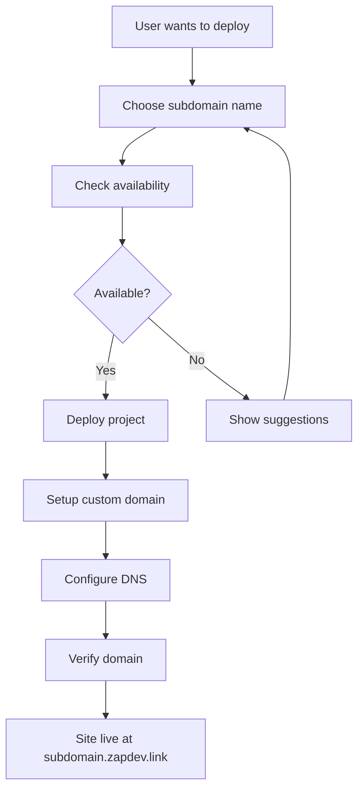
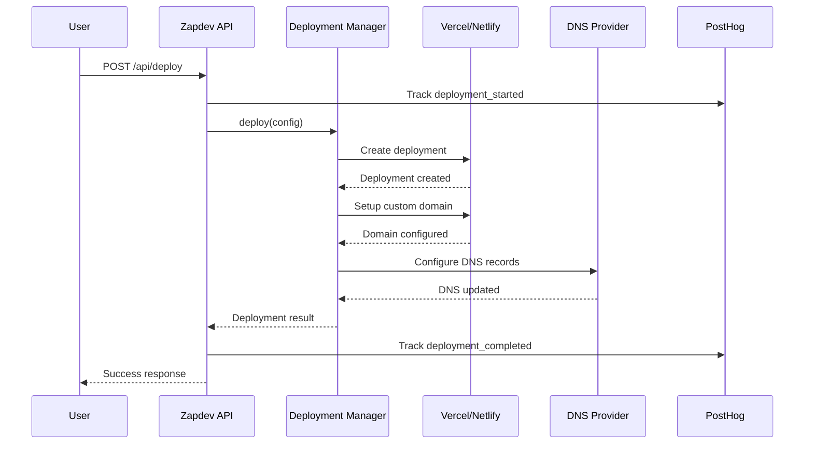

# 🚀 Zapdev Deployment System - Complete Guide

A powerful deployment system that integrates **Netlify** and **Vercel** APIs to enable users to deploy their sites with custom zapdev.link subdomains.

## ✨ Key Features

- **Multi-Platform Support**: Deploy to both Netlify and Vercel
- **Custom Subdomains**: Automatic setup of `nameoftheirchoice.zapdev.link`
- **PostHog Analytics**: Complete tracking of deployment events and metrics
- **File & Git Deployment**: Support for direct file uploads and Git repository deployment
- **Domain Management**: Full DNS configuration and verification
- **Production Ready**: Error handling, rate limiting, and comprehensive logging

## 🏗️ Architecture Overview

```
┌─────────────────────────────────────────────────────────────────┐
│                    Universal API Server                         │
│  ┌─────────────────┐  ┌─────────────────┐  ┌─────────────────┐ │
│  │  /api/deploy    │  │  /api/domains   │  │  PostHog        │ │
│  │                 │  │                 │  │  Analytics      │ │
│  └─────────────────┘  └─────────────────┘  └─────────────────┘ │
└─────────────────────────────────────────────────────────────────┘
                                 │
                    ┌─────────────────────────────┐
                    │    Deployment Manager       │
                    │  (Coordinates both services) │
                    └─────────────────────────────┘
                                 │
                    ┌─────────────┬─────────────┐
                    │             │             │
           ┌─────────────┐   ┌─────────────┐   │
           │   Netlify   │   │   Vercel    │   │
           │   Service   │   │   Service   │   │
           └─────────────┘   └─────────────┘   │
                    │             │             │
           ┌─────────────┐   ┌─────────────┐   │
           │ Netlify API │   │ Vercel API  │   │
           │ + Domains   │   │ + Domains   │   │
           └─────────────┘   └─────────────┘   │
                                               │
                    ┌─────────────────────────────┐
                    │      DNS Management         │
                    │   (nameoftheirchoice        │
                    │    .zapdev.link)            │
                    └─────────────────────────────┘
```

## 📋 Requirements & Setup

### Environment Variables

Create a `.env` file with the following configuration:

```bash
# === Deployment Platform Credentials ===
NETLIFY_ACCESS_TOKEN=your_netlify_personal_access_token
NETLIFY_TEAM_ID=your_netlify_team_id (optional)

VERCEL_ACCESS_TOKEN=your_vercel_access_token  
VERCEL_TEAM_ID=your_vercel_team_id (optional)

# === PostHog Analytics (Already configured in zapdev) ===
VITE_PUBLIC_POSTHOG_KEY=phc_your_posthog_project_key
VITE_PUBLIC_POSTHOG_HOST=https://app.posthog.com

# === Deployment Defaults ===
DEFAULT_DEPLOYMENT_PLATFORM=vercel
DEFAULT_BUILD_COMMAND=npm run build
DEFAULT_OUTPUT_DIR=dist
DEFAULT_NODE_VERSION=18.x

# === DNS Configuration (Optional - for advanced DNS management) ===
DNS_PROVIDER=cloudflare
DNS_API_KEY=your_dns_api_key
DNS_ZONE_ID=your_zone_id_for_zapdev_link
```

### Required API Tokens

#### Netlify Personal Access Token
1. Go to https://app.netlify.com/user/applications#personal-access-tokens
2. Click "New access token"
3. Name it "Zapdev Deployment"
4. Copy the token to `NETLIFY_ACCESS_TOKEN`

#### Vercel Access Token
1. Go to https://vercel.com/account/tokens
2. Click "Create Token"
3. Name it "Zapdev Deployment"
4. Copy the token to `VERCEL_ACCESS_TOKEN`

## 🚀 API Endpoints

### 1. Deployment API (`/api/deploy`)

#### Deploy a Project
```bash
POST /api/deploy
Content-Type: application/json

{
  "action": "deploy",
  "platform": "vercel",
  "projectName": "awesome-portfolio",
  "subdomain": "john-portfolio",
  "files": {
    "index.html": "<html>...</html>",
    "style.css": "body { ... }",
    "app.js": "console.log('Hello!');"
  },
  "environment": {
    "NODE_ENV": "production"
  }
}
```

**Response:**
```json
{
  "success": true,
  "deploymentId": "dpl_abc123",
  "url": "https://awesome-portfolio-xyz.vercel.app",
  "customDomain": "john-portfolio.zapdev.link",
  "status": "ready",
  "platform": "vercel"
}
```

#### Deploy from Git Repository
```bash
POST /api/deploy
Content-Type: application/json

{
  "action": "deploy",
  "platform": "netlify", 
  "projectName": "react-dashboard",
  "subdomain": "sarah-dashboard",
  "gitRepo": {
    "url": "https://github.com/user/react-dashboard.git",
    "branch": "main",
    "buildCommand": "npm run build",
    "outputDirectory": "build"
  }
}
```

#### Get Deployment Status
```bash
GET /api/deploy?action=status&platform=vercel&deploymentId=dpl_abc123
```

#### List All Deployments
```bash
GET /api/deploy?action=list&limit=20
```

### 2. Domains API (`/api/domains`)

#### Check Subdomain Availability
```bash
GET /api/domains?action=check&subdomain=awesome-project
```

**Response:**
```json
{
  "subdomain": "awesome-project",
  "domain": "awesome-project.zapdev.link",
  "valid": true,
  "available": true,
  "message": "awesome-project.zapdev.link is available!"
}
```

#### Setup Custom Subdomain
```bash
POST /api/domains
Content-Type: application/json

{
  "action": "setup",
  "subdomain": "my-portfolio",
  "platform": "vercel",
  "projectId": "prj_123abc"
}
```

#### Verify Domain Configuration
```bash
POST /api/domains
Content-Type: application/json

{
  "action": "verify",
  "subdomain": "my-portfolio", 
  "platform": "vercel",
  "projectId": "prj_123abc"
}
```

#### Get Setup Instructions
```bash
GET /api/domains?action=instructions&platform=netlify&subdomain=myproject
```

#### Generate Subdomain Suggestions
```bash
GET /api/domains?action=suggestions&subdomain=portfolio
```

## 📊 PostHog Analytics Events

The system automatically tracks these events:

### Deployment Events
- **`deployment_started`**: When a deployment begins
- **`deployment_completed`**: When a deployment succeeds
- **`deployment_failed`**: When a deployment fails

### Domain Events  
- **`domain_configured`**: When a custom domain is setup
- **`domain_verified`**: When a domain is verified

### Event Properties
```javascript
{
  platform: 'netlify' | 'vercel',
  project_name: string,
  subdomain: string,
  deployment_id?: string,
  duration_ms?: number,
  success: boolean,
  error_message?: string,
  custom_domain?: string
}
```

## 🌐 Custom Subdomain Flow

### 1. User Flow


### 2. Technical Flow


## 🔧 Advanced Configuration

### Custom DNS Management
For advanced users who want to manage DNS automatically:

```bash
# Cloudflare DNS (Recommended)
DNS_PROVIDER=cloudflare
DNS_API_KEY=your_cloudflare_api_key
DNS_ZONE_ID=your_zone_id_for_zapdev_link

# AWS Route53
DNS_PROVIDER=route53
AWS_ACCESS_KEY_ID=your_aws_key
AWS_SECRET_ACCESS_KEY=your_aws_secret
AWS_HOSTED_ZONE_ID=your_hosted_zone_id
```

### Platform-Specific Settings

#### Netlify Configuration
```bash
# Optional team settings
NETLIFY_TEAM_ID=your_team_id

# Build settings
NETLIFY_BUILD_COMMAND=npm run build
NETLIFY_PUBLISH_DIR=dist
```

#### Vercel Configuration  
```bash
# Optional team settings
VERCEL_TEAM_ID=your_team_id

# Framework presets
VERCEL_FRAMEWORK=nextjs
VERCEL_NODE_VERSION=18.x
```

## 🛠️ Development & Testing

### Running the API Server
```bash
# Start the Universal API Server
bun run api-dev-server.ts

# The deployment endpoints will be available at:
# http://localhost:3000/api/deploy
# http://localhost:3000/api/domains
```

### Testing Deployment
```bash
# Test subdomain availability
curl -X GET "http://localhost:3000/api/domains?action=check&subdomain=test-project"

# Test deployment (with files)
curl -X POST http://localhost:3000/api/deploy \
  -H "Content-Type: application/json" \
  -d '{
    "action": "deploy",
    "platform": "vercel",
    "projectName": "test-site",
    "subdomain": "test-site",
    "files": {
      "index.html": "<h1>Hello World!</h1>"
    }
  }'
```

### Monitoring & Logs
```bash
# View deployment logs in real-time
tail -f logs/deployment.log

# Check PostHog analytics for deployment events
# Go to PostHog dashboard > Events > Filter by "deployment_"
```

## 📖 Usage Examples

### Frontend Integration (React/Vue/Vanilla JS)
```javascript
// Deploy a project
async function deployProject(config) {
  const response = await fetch('/api/deploy', {
    method: 'POST',
    headers: { 'Content-Type': 'application/json' },
    body: JSON.stringify({
      action: 'deploy',
      platform: 'vercel',
      projectName: config.name,
      subdomain: config.subdomain,
      files: config.files
    })
  });
  
  return await response.json();
}

// Check subdomain availability
async function checkSubdomain(subdomain) {
  const response = await fetch(`/api/domains?action=check&subdomain=${subdomain}`);
  return await response.json();
}

// Get deployment status
async function getDeploymentStatus(platform, deploymentId) {
  const response = await fetch(`/api/deploy?action=status&platform=${platform}&deploymentId=${deploymentId}`);
  return await response.json();
}
```

### CLI Usage
```bash
# Check subdomain
curl "http://localhost:3000/api/domains?action=check&subdomain=myproject"

# Deploy files
curl -X POST http://localhost:3000/api/deploy \
  -H "Content-Type: application/json" \
  -d @deployment-config.json

# Get status  
curl "http://localhost:3000/api/deploy?action=status&platform=vercel&deploymentId=dpl_123"
```

## 🔒 Security & Best Practices

### API Security
- All endpoints validate input parameters
- Rate limiting is applied (1000 requests/minute per IP)
- Deployment IDs and project IDs are validated
- Environment variables are never exposed in responses

### Domain Security
- Subdomain validation follows RFC standards
- Reserved words are blocked
- Maximum length limits are enforced
- Special characters are sanitized

### Analytics Privacy
- No sensitive data is tracked
- User identifiers are anonymized
- Error messages are sanitized before tracking

## 🚨 Troubleshooting

### Common Issues

#### 1. "Service not configured" Error
```bash
# Check that API tokens are set
echo $NETLIFY_ACCESS_TOKEN
echo $VERCEL_ACCESS_TOKEN

# Verify tokens are valid
curl -H "Authorization: Bearer $NETLIFY_ACCESS_TOKEN" https://api.netlify.com/api/v1/user
```

#### 2. Domain Verification Fails
```bash
# Check DNS propagation
dig your-subdomain.zapdev.link

# Verify domain configuration
curl "http://localhost:3000/api/domains?action=verify&subdomain=your-subdomain&platform=vercel"
```

#### 3. Deployment Stuck in "Building" Status
```bash
# Check deployment logs
curl "http://localhost:3000/api/deploy?action=status&platform=vercel&deploymentId=dpl_123"

# Try redeploying
curl -X POST http://localhost:3000/api/deploy -H "Content-Type: application/json" -d '...'
```

### Debug Mode
Enable debug logging:
```bash
NODE_ENV=development DEBUG=zapdev:deployment bun run api-dev-server.ts
```

## 📈 Monitoring & Analytics

### PostHog Dashboard
Create custom insights in PostHog:
1. **Deployment Success Rate**: `deployment_completed` vs `deployment_failed`
2. **Platform Usage**: Group by `platform` property
3. **Popular Subdomains**: Track `subdomain` values
4. **Deployment Duration**: Average `duration_ms` 

### Server Metrics
Available at `/health` endpoint:
```json
{
  "status": "healthy",
  "metrics": {
    "totalDeployments": 1547,
    "successfulDeployments": 1523,
    "failedDeployments": 24,
    "averageDeploymentTime": 45670
  },
  "platforms": ["netlify", "vercel"],
  "timestamp": "2024-01-20T10:30:45.123Z"
}
```

---

## 🎉 Success! 

Your zapdev deployment system is now ready to handle:
- ✅ **Multi-platform deployments** (Netlify & Vercel)
- ✅ **Custom subdomain setup** (`nameoftheirchoice.zapdev.link`)
- ✅ **Complete analytics tracking** via PostHog
- ✅ **Production-ready API endpoints**
- ✅ **Comprehensive error handling**
- ✅ **Real-time deployment monitoring**

Users can now deploy their sites with beautiful custom zapdev.link subdomains! 🚀