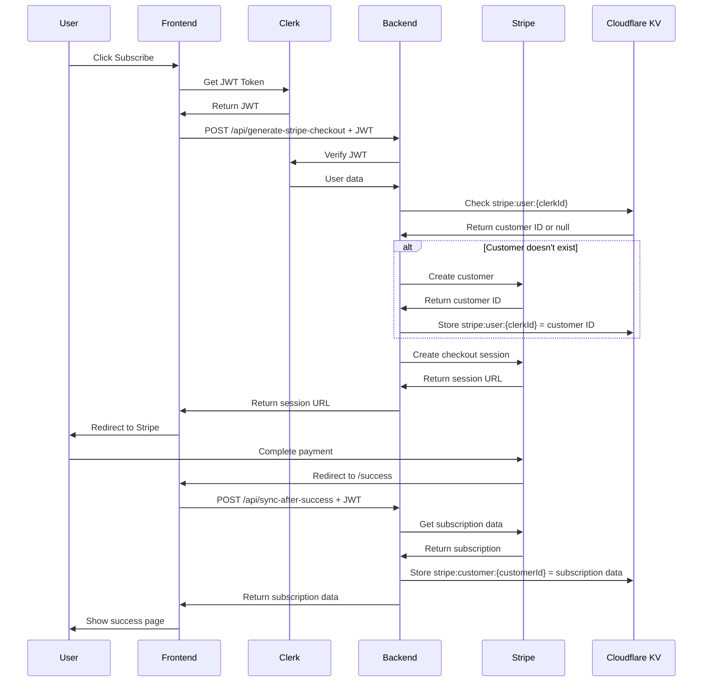

# Complete Integration Example

This example shows you exactly how to use the Stripe + Clerk + Cloudflare KV integration in practice.

## 🏗️ Project Structure

```
src/
├── lib/
│   ├── stripe.ts              # Stripe configuration
│   ├── clerk-auth.ts          # Clerk JWT handling
│   ├── cloudflare-kv.ts       # Cloudflare KV adapter
│   └── kv-stripe.ts           # Stripe + KV integration
├── api/
│   ├── generate-stripe-checkout.ts
│   ├── sync-after-success.ts
│   └── stripe-webhook.ts
├── components/
│   ├── ClerkProvider.tsx      # Clerk auth wrapper
│   ├── SubscribeButton.tsx    # Subscription button
│   └── SubscriptionStatus.tsx # Current subscription display
└── pages/
    └── Success.tsx            # Post-payment page
```

## 🔐 Step-by-Step JWT Flow

### 1. Frontend: User Authentication

```tsx
// src/App.tsx
import { ClerkProvider } from '@/components/ClerkProvider';
import { BrowserRouter, Routes, Route } from 'react-router-dom';
import PricingPage from '@/pages/Pricing';
import Success from '@/pages/Success';

function App() {
  return (
    <ClerkProvider>
      <BrowserRouter>
        <Routes>
          <Route path="/pricing" element={<PricingPage />} />
          <Route path="/success" element={<Success />} />
        </Routes>
      </BrowserRouter>
    </ClerkProvider>
  );
}
```

### 2. Frontend: Pricing Page with Subscribe Button

```tsx
// src/pages/Pricing.tsx
import { SubscribeButton } from '@/components/SubscribeButton';
import { useAuth } from '@clerk/clerk-react';

export default function Pricing() {
  const { isSignedIn, user } = useAuth();

  return (
    <div className="max-w-4xl mx-auto p-8">
      <h1 className="text-3xl font-bold mb-8">Choose Your Plan</h1>
      
      <div className="grid md:grid-cols-2 gap-8">
        {/* Basic Plan */}
        <div className="border rounded-lg p-6">
          <h2 className="text-xl font-semibold mb-4">Basic Plan</h2>
          <p className="text-3xl font-bold mb-4">$9.99<span className="text-lg">/month</span></p>
          <ul className="mb-6 space-y-2">
            <li>✓ Basic features</li>
            <li>✓ Email support</li>
            <li>✓ 5 projects</li>
          </ul>
          <SubscribeButton 
            priceId="price_basic_monthly" // Your Stripe price ID
            planName="Basic Plan"
            className="w-full"
          />
        </div>

        {/* Pro Plan */}
        <div className="border rounded-lg p-6 border-blue-500">
          <h2 className="text-xl font-semibold mb-4">Pro Plan</h2>
          <p className="text-3xl font-bold mb-4">$19.99<span className="text-lg">/month</span></p>
          <ul className="mb-6 space-y-2">
            <li>✓ All Basic features</li>
            <li>✓ Priority support</li>
            <li>✓ Unlimited projects</li>
            <li>✓ Advanced analytics</li>
          </ul>
          <SubscribeButton 
            priceId="price_pro_monthly" // Your Stripe price ID
            planName="Pro Plan"
            className="w-full"
          />
        </div>
      </div>

      {isSignedIn && (
        <div className="mt-8 p-4 bg-blue-50 rounded-lg">
          <p>👋 Hey {user?.firstName}! Ready to upgrade?</p>
        </div>
      )}
    </div>
  );
}
```

### 3. Frontend: Subscribe Button Flow

When user clicks subscribe, here's what happens:

```typescript
// Inside SubscribeButton component
const handleSubscribe = async () => {
  // 1. Get Clerk JWT token
  const token = await getToken(); // Clerk's useAuth hook
  
  // 2. Call your backend with JWT in Authorization header
  const response = await fetch('/api/generate-stripe-checkout', {
    method: 'POST',
    headers: {
      'Content-Type': 'application/json',
      'Authorization': `Bearer ${token}`, // <- JWT here
    },
    body: JSON.stringify({ priceId: 'price_pro_monthly' }),
  });
  
  // 3. Get Stripe checkout URL and redirect
  const { url } = await response.json();
  window.location.href = url;
};
```

### 4. Backend: JWT Verification & Stripe Integration

```typescript
// Your Express server endpoint
app.post('/api/generate-stripe-checkout', async (req, res) => {
  try {
    const { priceId } = req.body;
    const headers = req.headers;
    
    // 1. Verify JWT and get user info
    const user = await authenticateWithClerk(headers);
    // Returns: { id: 'clerk_user_123', email: 'user@example.com', name: 'John Doe' }
    
    // 2. Create/get Stripe customer mapped to Clerk user
    const result = await generateStripeCheckout(headers, priceId);
    
    res.json(result);
  } catch (error) {
    res.status(500).json({ error: error.message });
  }
});
```

### 5. Backend: Stripe Customer Creation & KV Storage

```typescript
// Inside generateStripeCheckout function
const user = await authenticateWithClerk(headers); // JWT verified here

// Check KV for existing Stripe customer
let stripeCustomerId = await kv.get(`stripe:user:${user.id}`);

if (!stripeCustomerId) {
  // Create new Stripe customer
  const customer = await stripe.customers.create({
    email: user.email,
    name: user.name,
    metadata: { clerkUserId: user.id }
  });
  
  // Store mapping in Cloudflare KV
  await kv.set(`stripe:user:${user.id}`, customer.id);
  stripeCustomerId = customer.id;
}

// Create checkout session
const session = await stripe.checkout.sessions.create({
  customer: stripeCustomerId,
  line_items: [{ price: priceId, quantity: 1 }],
  mode: 'subscription',
  success_url: 'http://localhost:5173/success?session_id={CHECKOUT_SESSION_ID}',
  cancel_url: 'http://localhost:5173/pricing',
});
```

## 🎯 Complete Data Flow



## 🔑 Key Data Structures

### Cloudflare KV Storage

```typescript
// User to Stripe customer mapping
kv.set('stripe:user:clerk_user_123', 'cus_stripe_abc123');

// Subscription data storage
kv.set('stripe:customer:cus_stripe_abc123', {
  subscriptionId: 'sub_xyz789',
  status: 'active',
  priceId: 'price_pro_monthly',
  currentPeriodStart: 1703980800,
  currentPeriodEnd: 1706659200,
  cancelAtPeriodEnd: false,
  paymentMethod: {
    brand: 'visa',
    last4: '4242'
  }
});
```

### Clerk JWT Payload

```json
{
  "sub": "clerk_user_123",
  "email": "user@example.com",
  "first_name": "John",
  "last_name": "Doe",
  "iat": 1703980800,
  "exp": 1703984400
}
```

## 🚀 Quick Start Commands

### 1. Install Dependencies
```bash
bun add stripe @clerk/clerk-react
```

### 2. Set Environment Variables
```bash
# .env.local
VITE_CLERK_PUBLISHABLE_KEY=pk_test_...
CLERK_SECRET_KEY=sk_test_...
STRIPE_SECRET_KEY=sk_test_...
NEXT_PUBLIC_STRIPE_PUBLISHABLE_KEY=pk_test_...
CLOUDFLARE_ACCOUNT_ID=...
CLOUDFLARE_NAMESPACE_ID=...
CLOUDFLARE_API_TOKEN=...
```

### 3. Test KV Connection
```bash
node -e "
import('./src/lib/cloudflare-kv.js').then(({ kv }) => {
  kv.set('test', 'hello').then(() => {
    return kv.get('test');
  }).then(value => {
    console.log('KV Test:', value);
  });
});
"
```

### 4. Start Development
```bash
# Frontend
bun run dev

# Backend (in another terminal)
node server/index.js
```

## 🧪 Testing the Flow

### 1. Test Authentication
1. Go to `/pricing`
2. Sign up/in with Clerk
3. Check that user state loads correctly

### 2. Test Subscription
1. Click a subscribe button
2. Complete payment with test card: `4242 4242 4242 4242`
3. Check you're redirected to `/success`
4. Verify data appears in Cloudflare KV dashboard

### 3. Test Webhooks
1. Use Stripe CLI: `stripe listen --forward-to localhost:3001/api/stripe`
2. Trigger webhook events
3. Check KV data updates automatically

## 🐛 Common Issues & Solutions

### Issue: "Missing Clerk token"
**Solution**: Make sure `ClerkProvider` wraps your app and user is signed in.

### Issue: "KV 401 Unauthorized"
**Solution**: Check your Cloudflare API token permissions.

### Issue: "Stripe customer not found"
**Solution**: Check webhook is working and customer creation succeeded.

### Issue: "JWT verification failed"
**Solution**: Ensure CLERK_SECRET_KEY is set on backend.

## 📊 Monitoring in Production

### Cloudflare KV Dashboard
- Monitor read/write operations
- View stored data
- Check for errors

### Stripe Dashboard
- Monitor subscription events
- Check webhook delivery status
- View customer data

### Clerk Dashboard
- Monitor user sessions
- Check JWT token usage
- View user analytics

This integration gives you a robust, scalable subscription system with secure authentication and fast global data storage! 🎉 