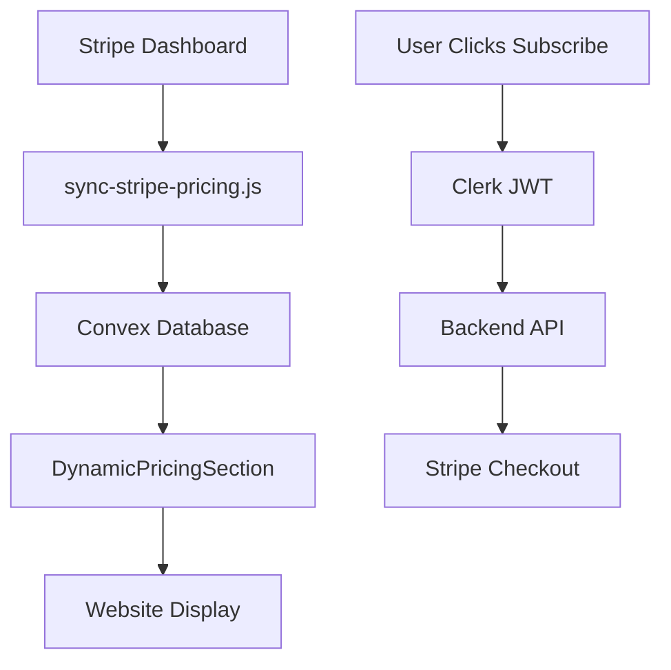

# Stripe Pricing Integration Setup

This guide shows you how to sync your Stripe pricing data with your website pricing display using Convex database.

## 🎯 What This Does

- ✅ **Real Stripe Pricing** - Display actual prices from your Stripe dashboard
- ✅ **Automatic Sync** - One command syncs all products and prices
- ✅ **Real-time Updates** - Uses Convex for live pricing updates
- ✅ **Easy Management** - Configure features and metadata in one script
- ✅ **Fallback Support** - Shows helpful messages when no data exists

## 🚀 Quick Setup

### 1. Create Stripe Products & Prices

First, create your products in your Stripe dashboard:

1. Go to [Stripe Dashboard → Products](https://dashboard.stripe.com/products)
2. Create your products (e.g., "Starter", "Professional", "Enterprise")
3. Add prices for each product (monthly/yearly subscriptions)
4. Note down the product IDs (they start with `prod_`)

### 2. Configure Product Metadata

Edit `scripts/sync-stripe-pricing.js` and update the `PRODUCT_CONFIG` object with your actual Stripe product IDs:

```javascript
const PRODUCT_CONFIG = {
  // Replace with your actual Stripe product IDs
  'prod_ABC123starter': {
    tier: 'starter',
    features: JSON.stringify([
      '5 AI-generated websites',
      'Basic templates library',
      'Standard hosting',
      'Email support'
    ]),
    popular: 'false',
    order: '1'
  },
  'prod_DEF456professional': {
    tier: 'professional',
    features: JSON.stringify([
      'Unlimited websites',
      'Premium templates',
      'Custom domain support',
      'Priority support',
      'Advanced AI prompts',
      'Analytics dashboard'
    ]),
    popular: 'true', // Mark as most popular
    order: '2'
  },
  'prod_GHI789enterprise': {
    tier: 'enterprise',
    features: JSON.stringify([
      'White-label solution',
      'Custom integrations',
      'Dedicated support team',
      'Advanced security',
      'Custom AI training',
      'SLA guarantee'
    ]),
    popular: 'false',
    order: '3'
  }
};
```

### 3. Environment Variables

Make sure these are set in your `.env.local`:

```bash
# Stripe
STRIPE_SECRET_KEY=sk_test_...
NEXT_PUBLIC_STRIPE_PUBLISHABLE_KEY=pk_test_...

# Convex
VITE_CONVEX_URL=https://your-deployment.convex.cloud
```

### 4. Deploy Schema Changes

```bash
# Deploy the new Convex schema with Stripe pricing tables
bun convex deploy
```

### 5. Sync Pricing Data

```bash
# List your current Stripe products (to get product IDs)
bun run list-stripe-products

# After updating PRODUCT_CONFIG, sync the data
bun run sync-pricing
```

### 6. Start Development

```bash
# Start Convex development (for type generation)
bun convex dev

# In another terminal, start your app
bun run dev
```

## 📋 Commands

### List Stripe Products
```bash
bun run list-stripe-products
```
Shows all your Stripe products with IDs and prices - use this to configure `PRODUCT_CONFIG`.

### Sync Pricing Data
```bash
bun run sync-pricing
```
Syncs all Stripe products and prices to Convex database.

## 📊 How It Works

### Data Flow



### Database Tables

**stripeProducts**
```typescript
{
  stripeProductId: "prod_ABC123",
  name: "Professional",
  description: "Advanced features for growing startups",
  active: true,
  metadata: {
    tier: "professional",
    features: "[\"Unlimited websites\", ...]", // JSON string
    popular: "true",
    order: "2"
  }
}
```

**stripePrices**
```typescript
{
  stripePriceId: "price_DEF456",
  stripeProductId: "prod_ABC123",
  active: true,
  currency: "usd",
  recurring: {
    interval: "month",
    intervalCount: 1
  },
  type: "recurring",
  unitAmount: 4900 // $49.00 in cents
}
```

## 🎨 Frontend Integration

The pricing components automatically use Convex queries:

```tsx
// DynamicPricingSection.tsx
const pricingData = useQuery(api.stripe.getPricingData);

// Real-time updates when pricing changes in Stripe
// No manual API calls needed!
```

## 🔄 Keeping Prices Updated

### Manual Sync
Run the sync command whenever you update prices in Stripe:
```bash
bun run sync-pricing
```

### Automated Sync (Optional)
You can set up a webhook or cron job to automatically sync pricing:

1. **Webhook**: Listen for Stripe product/price events
2. **Cron Job**: Run sync script daily/weekly
3. **CI/CD**: Sync during deployments

## 📝 Customization

### Custom Features
Update the features array in `PRODUCT_CONFIG`:

```javascript
features: JSON.stringify([
  'Custom feature 1',
  'Custom feature 2',
  'Custom feature 3'
])
```

### Popular Plan
Set `popular: 'true'` for the plan you want highlighted:

```javascript
popular: 'true' // Shows "Most Popular" badge
```

### Display Order
Control the order with the `order` field:

```javascript
order: '1' // Lower numbers appear first
```

### Pricing Display
The component automatically:
- Formats prices in the correct currency
- Shows monthly/yearly intervals
- Handles free plans and custom pricing
- Displays "Contact Sales" for products without prices

## 🐛 Troubleshooting

### "No pricing plans available"
1. Check if you've run `bun run sync-pricing`
2. Verify your Stripe products are active
3. Check environment variables are set correctly

### "Failed to create checkout session"
1. Verify Clerk authentication is working
2. Check backend API endpoint is running
3. Ensure Stripe webhook is configured

### Pricing not updating
1. Re-run `bun run sync-pricing`
2. Check Convex dashboard for data
3. Verify `bun convex dev` is running for type updates

### TypeScript errors
1. Run `bun convex dev` to regenerate types
2. Restart your development server
3. Check that Convex schema is deployed

## 📈 Production Checklist

- [ ] Update `PRODUCT_CONFIG` with production Stripe product IDs
- [ ] Set production environment variables
- [ ] Deploy Convex schema: `bun convex deploy --prod`
- [ ] Sync production pricing: `bun run sync-pricing`
- [ ] Test checkout flow end-to-end
- [ ] Set up automated pricing sync (optional)

## 🎉 Benefits

### Real-time Pricing
- Prices update automatically across your site
- No more hardcoded pricing that gets out of sync
- Convex provides instant updates to all users

### Easy Management
- Update prices in Stripe dashboard
- Run one command to sync everywhere
- Configure features and metadata in code

### Reliable Integration
- Direct connection to Stripe
- Type-safe with Convex
- Handles edge cases gracefully

Your pricing is now fully synced with Stripe! 🚀 