# ZapDev Tech Stack Overview

## Executive Summary

**ZapDev** is a modern, full-stack AI-powered development platform built with cutting-edge technologies. It enables users to create production-ready web applications through conversational AI interactions, with code generation across multiple frameworks executed in isolated sandboxes with real-time previews.

---

## Architecture Diagram

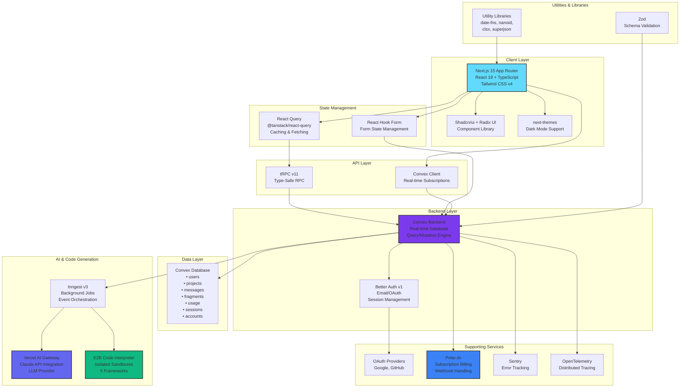

---

## Core Technology Stack

### Frontend (Client-Side)

| Technology | Version | Purpose | Details |
|---|---|---|---|
| **Next.js** | 16 | Full-stack React framework | App Router, Turbopack (dev), SSR capable |
| **React** | 19.2.0 | UI library | Component-based, Hooks, Strict Mode |
| **TypeScript** | 5.9.3 | Type safety | Strict configuration, End-to-end typing |
| **Tailwind CSS** | 4.1.16 | Styling | Utility-first, PostCSS plugins, v4 optimizations |
| **Shadcn/ui** | Latest | Component library | Accessible, Customizable, Radix-based |
| **Radix UI** | Latest | Headless UI primitives | Accessibility, Dialog, Dropdown, Select, etc. |

### State Management & Forms

| Technology | Version | Purpose | Details |
|---|---|---|---|
| **React Query** | 5.90.6 | Server state management | Automatic caching, refetching, optimistic updates |
| **React Hook Form** | 7.66.0 | Form state | Lightweight, minimal re-renders, Zod integration |
| **next-themes** | 0.4.6 | Theme management | Dark/light mode, System preference detection |

### Backend & Database

| Technology | Version | Purpose | Details |
|---|---|---|---|
| **Convex** | 1.29.0 | Real-time database | Replaces PostgreSQL, TypeScript-first, Subscriptions |
| **tRPC** | 11.7.1 | Type-safe APIs | Automatic type inference, Server/Client separation |
| **Better Auth** | 1.3.34 | Authentication | Email/password, OAuth, Session management |

### AI & Code Generation

| Technology | Version | Purpose | Details |
|---|---|---|---|
| **Vercel AI Gateway** | Custom | LLM provider | Claude API integration, Token management |
| **Inngest** | 3.44.5 | Background jobs | Event-driven, Workflow orchestration, Retry logic |
| **E2B Code Interpreter** | 1.5.1 | Sandbox execution | Isolated environments, Multi-framework support |
| **Inngest Agent Kit** | 0.8.4 | AI tool integration | Tool calling, Function definitions |

### Billing & Subscriptions

| Technology | Version | Purpose | Details |
|---|---|---|---|
| **Polar.sh SDK** | 0.41.1 | Subscription management | Product management, Webhook handling, Customer portal |

### Monitoring & Observability

| Technology | Version | Purpose | Details |
|---|---|---|---|
| **Sentry** | 10.22.0 | Error tracking | Production error monitoring, Session replay |
| **OpenTelemetry** | Latest | Distributed tracing | Instrumentation, Span tracking, Performance metrics |

### Utilities & Validation

| Technology | Version | Purpose | Details |
|---|---|---|---|
| **Zod** | 3.25.76 | Schema validation | Type-safe runtime validation, Automatic TypeScript inference |
| **date-fns** | 4.1.0 | Date manipulation | Lightweight, Modular, Immutable |
| **nanoid** | 5.1.6 | ID generation | URL-friendly unique IDs |
| **superjson** | 2.2.5 | JSON serialization | BigInt, Date, undefined support |
| **clsx** | 2.1.1 | Conditional classnames | Utility for CSS class management |

---

## Database Schema

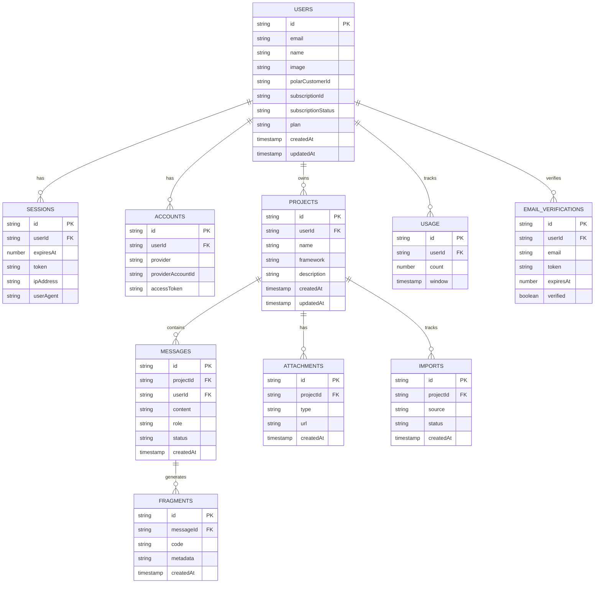

---

## Data Flow Architecture

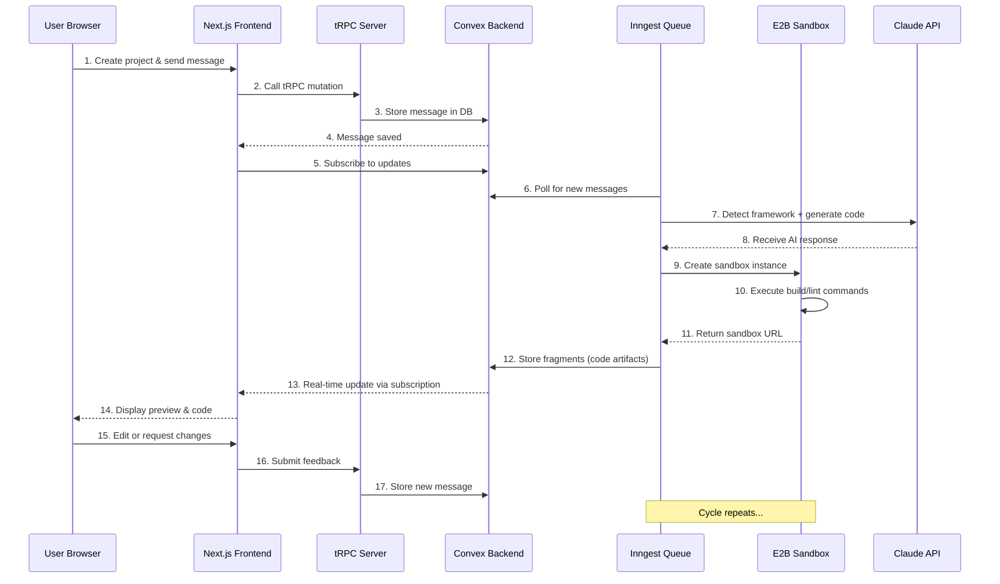

---

## Framework Support

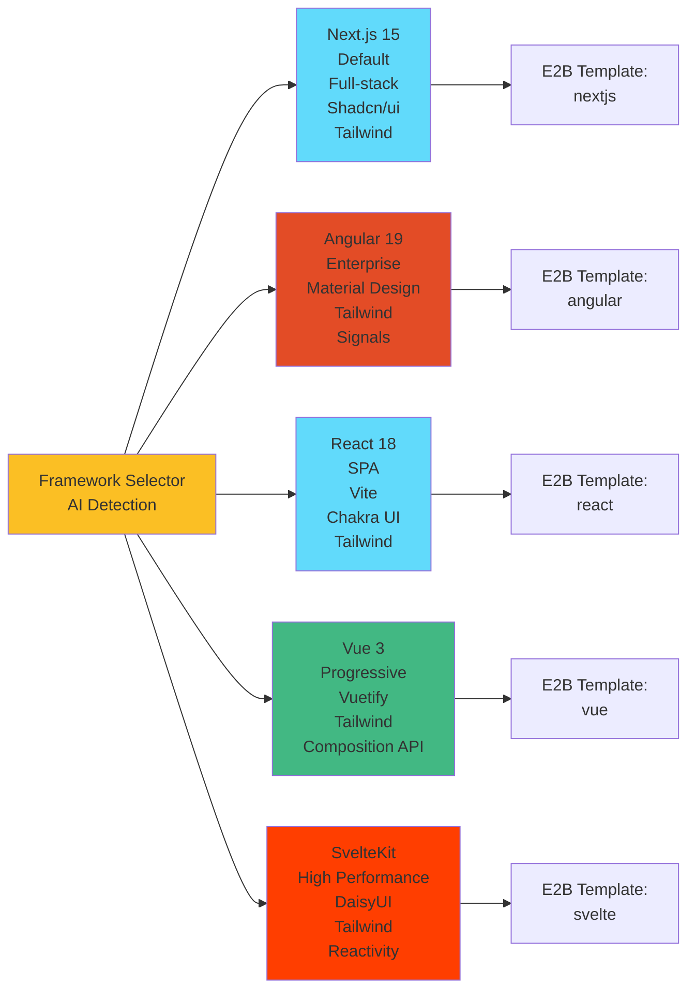

---

## Authentication Flow

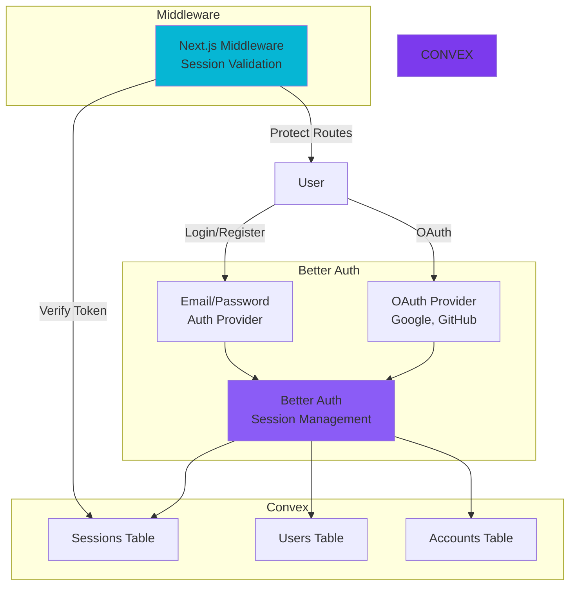

---

## Credit System (Rate Limiting)

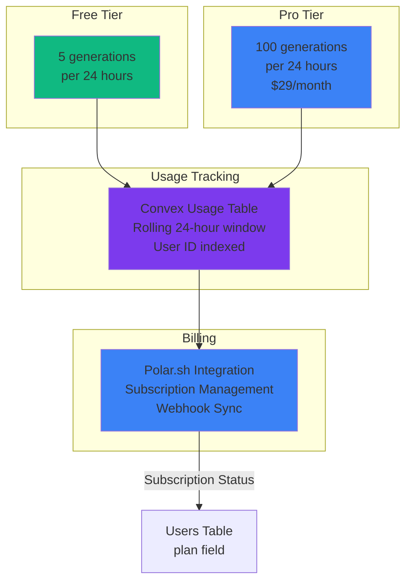

---

## AI Code Generation Pipeline

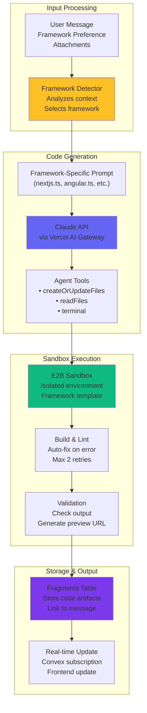

---

## Development Environment Setup

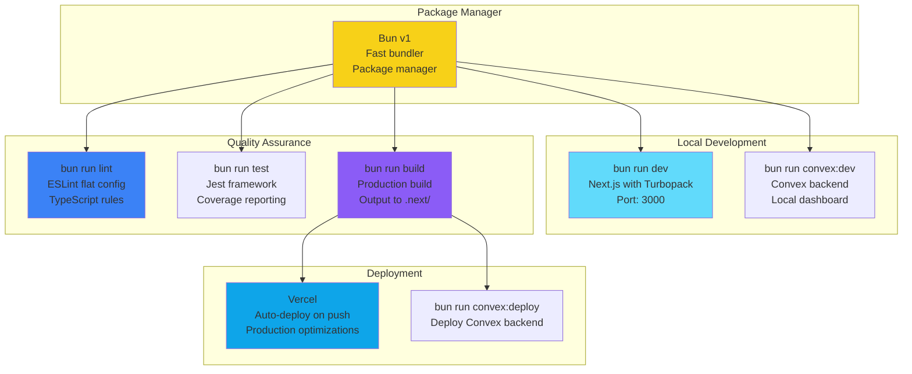

---

## API Structure

### tRPC Routers

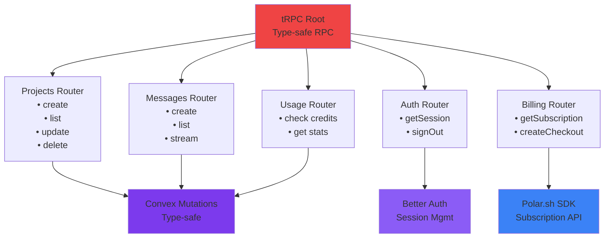

---

## Security & Compliance

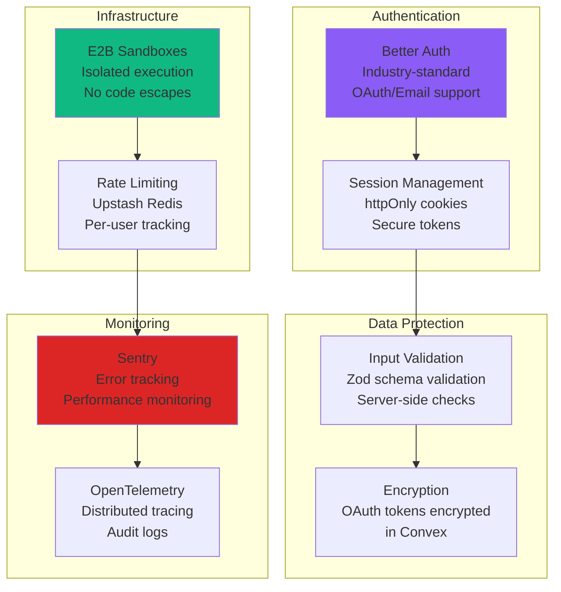

---

## Performance Optimizations

| Category | Technology | Benefit |
|----------|-----------|---------|
| **Bundle** | Turbopack (dev), Code splitting | Faster builds, Smaller chunks |
| **Images** | Next.js Image, AVIF/WebP | Optimized delivery, Modern formats |
| **CSS** | Tailwind v4, Critters | Minimal CSS, Critical path inlined |
| **Data Fetching** | React Query | Automatic caching, Stale-while-revalidate |
| **Database** | Convex subscriptions | Real-time updates, Efficient queries |
| **Form State** | React Hook Form | Minimal re-renders, Lazy validation |
| **Monitoring** | Web Vitals, Speed Insights | Performance metrics tracking |

---

## Development Workflow

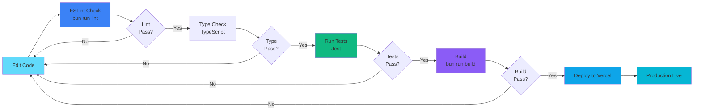

---

## Integration Ecosystem

```mermaid
graph TB
    ZapDev["ZapDev<br/>Core Platform"]
    
    subgraph "External Services"
        VERCEL["Vercel<br/>Hosting<br/>AI Gateway<br/>KV Storage"]
        E2B_SVC["E2B<br/>Code Sandboxes<br/>Template mgmt"]
        CLAUDE["Claude API<br/>via Vercel<br/>LLM Provider"]
        INNGEST_SVC["Inngest<br/>Event Queue<br/>Workflow Engine"]
        POLAR["Polar.sh<br/>Billing<br/>Webhooks"]
    end

    subgraph "Optional Integrations"
        FIGMA["Figma<br/>Design import<br/>OAuth"]
        GITHUB["GitHub<br/>Code reference<br/>OAuth"]
        SENTRY_SVC["Sentry<br/>Error tracking"]
    end

    ZapDev --> VERCEL
    ZapDev --> E2B_SVC
    ZapDev --> CLAUDE
    ZapDev --> INNGEST_SVC
    ZapDev --> POLAR
    ZapDev -.-> FIGMA
    ZapDev -.-> GITHUB
    ZapDev -.-> SENTRY_SVC

    style ZapDev fill:#7c3aed,color:#fff
    style VERCEL fill:#000
    style CLAUDE fill:#6366f1
    style POLAR fill:#3b82f6
    style INNGEST_SVC fill:#8b5cf6
    style E2B_SVC fill:#10b981
```

---

## Environment Variables Summary

### Required Variables

```bash
# Application
NEXT_PUBLIC_APP_URL=http://localhost:3000

# Convex Database
NEXT_PUBLIC_CONVEX_URL=<convex-url>
CONVEX_DEPLOYMENT=<deployment-name>

# AI Gateway
AI_GATEWAY_API_KEY=<vercel-ai-gateway-key>
AI_GATEWAY_BASE_URL=https://ai-gateway.vercel.sh/v1/

# Code Execution
E2B_API_KEY=<e2b-api-key>

# Authentication (Better Auth)
BETTER_AUTH_SECRET=<generate-with-openssl-rand-base64-32>
BETTER_AUTH_URL=http://localhost:3000

# Billing (Polar.sh)
POLAR_ACCESS_TOKEN=<polar-api-token>
POLAR_ORGANIZATION_ID=<org-id>
NEXT_PUBLIC_POLAR_PRODUCT_ID_PRO=<product-id>
POLAR_WEBHOOK_SECRET=<webhook-secret>

# Background Jobs (Inngest)
INNGEST_EVENT_KEY=<inngest-event-key>
INNGEST_SIGNING_KEY=<inngest-signing-key>
```

### Optional Variables

```bash
# OAuth Providers
GOOGLE_CLIENT_ID=<google-oauth-client-id>
GOOGLE_CLIENT_SECRET=<google-oauth-secret>
GITHUB_CLIENT_ID=<github-oauth-client-id>
GITHUB_CLIENT_SECRET=<github-oauth-secret>

# Design Integrations
FIGMA_CLIENT_ID=<figma-oauth-id>
FIGMA_CLIENT_SECRET=<figma-oauth-secret>

# Monitoring
NEXT_PUBLIC_SENTRY_DSN=<sentry-public-dsn>
SENTRY_DSN=<sentry-private-dsn>

# Rate Limiting
UPSTASH_REDIS_REST_URL=<redis-url>
UPSTASH_REDIS_REST_TOKEN=<redis-token>
```

---

## Technology Matrix Summary

| Layer | Primary | Secondary | Purpose |
|-------|---------|-----------|---------|
| **Frontend** | Next.js 15, React 19 | Tailwind, Shadcn/ui | UI rendering, SSR |
| **State** | React Query | React Hook Form | Server + client state |
| **API** | tRPC | Convex subscriptions | Type-safe communication |
| **Backend** | Convex | Better Auth, Polar.sh | Data + auth + billing |
| **AI** | Claude (via Vercel) | Inngest + E2B | Code generation |
| **Observability** | Sentry | OpenTelemetry | Monitoring + tracing |
| **Package Mgmt** | Bun | npm scripts | Dependency management |
| **Testing** | Jest | ts-jest | Unit + integration tests |

---

## Deployment Architecture

```mermaid
graph TB
    subgraph "Development"
        LOCAL["Local Machine<br/>bun run dev<br/>bun run convex:dev"]
    end

    subgraph "Version Control"
        GIT["Git Repository<br/>GitHub<br/>Feature branches"]
    end

    subgraph "CI/CD Pipeline"
        LINT["Lint Check<br/>ESLint"]
        TEST["Test Suite<br/>Jest"]
        BUILD["Production Build<br/>Turbopack"]
    end

    subgraph "Production"
        VERCEL["Vercel<br/>Next.js Hosting<br/>Edge Functions"]
        CONVEX_PROD["Convex Production<br/>Managed Database<br/>Backups"]
    end

    LOCAL --> GIT
    GIT --> LINT
    LINT --> TEST
    TEST --> BUILD
    BUILD --> VERCEL
    BUILD --> CONVEX_PROD

    style LOCAL fill:#61dafb
    style GIT fill:#333
    style VERCEL fill:#000
    style CONVEX_PROD fill:#7c3aed
```

---

## Key Metrics & Constraints

| Metric | Value | Notes |
|--------|-------|-------|
| **E2B Sandbox Timeout** | 60 minutes | Max execution time per instance |
| **Free Tier Credits** | 5 generations/24h | Rolling window |
| **Pro Tier Credits** | 100 generations/24h | $29/month via Polar.sh |
| **Session Expiry** | Configurable | Default 30 days (Better Auth) |
| **Real-time Subscriptions** | Unlimited | Convex native feature |
| **File Storage** | Unlimited | Convex + fragments table |
| **Concurrent Sandboxes** | Limited by E2B plan | Typically 10-50 concurrent |

---

## Versions & Compatibility

```mermaid
graph TB
    NODE["Node.js 18+<br/>LTS recommended"]
    BUN["Bun 1.x<br/>Latest stable"]
    NEXT["Next.js 16<br/>Latest stable"]
    REACT["React 19<br/>Latest version"]
    TS["TypeScript 5.9+<br/>Strict mode"]
    
    BUN --> NEXT
    NODE --> NEXT
    NEXT --> REACT
    NEXT --> TS
    
    style NODE fill:#68a063
    style BUN fill:#f7d118
    style NEXT fill:#000
    style REACT fill:#61dafb
    style TS fill:#3178c6
```

---

## Getting Started Quick Reference

```bash
# 1. Install dependencies
bun install

# 2. Setup environment variables
cp env.example .env.local
# Edit .env.local with your API keys

# 3. Terminal 1: Frontend development
bun run dev

# 4. Terminal 2: Backend development
bun run convex:dev

# 5. Open browser
# Navigate to http://localhost:3000

# 6. Quality checks (before commit)
bun run lint      # ESLint
bun run test      # Jest
bun run build     # Production build

# 7. Deploy (Vercel + Convex)
bun run convex:deploy  # Deploy Convex backend
git push                # Trigger Vercel auto-deploy
```

---

## Documentation References

- **Full Setup Guide**: `BETTER_AUTH_POLAR_SETUP.md`
- **Convex Database**: `README_CONVEX.md`
- **AI Optimization**: `vercel_ai_gateway_optimization.md`
- **Architecture Guide**: `CLAUDE.md` and `AGENTS.md`
- **Migration Status**: `MIGRATION_STATUS.md`

---

## Additional Resources

- [Next.js Documentation](https://nextjs.org/docs)
- [Convex Documentation](https://docs.convex.dev)
- [tRPC Documentation](https://trpc.io)
- [Better Auth Docs](https://www.better-auth.com)
- [Inngest Docs](https://www.inngest.com/docs)
- [E2B Docs](https://e2b.dev)
- [Tailwind CSS](https://tailwindcss.com)
- [Zod Documentation](https://zod.dev)

---

**Last Updated**: November 2025
**Maintained By**: ZapDev Development Team
